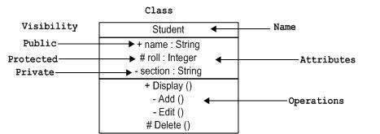
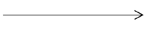

# UML
- UML stands for Unified Modeling Language
- It is a modeling language (It is used for communication)
> Unified Modeling Language is a standard language for visualizing and **documenting** the artifacts of **software systems**.

#### Object-Oriented Concepts
UML is used to describe and represent the Object-Oriented Concepts.

> ### Class Notation
>.

> ### Class Diagram
> The class diagram is one of the uml diagrams.
> It consists of three parts:
> - Class Name
> - Attributes
> - Operations
>
>> #### Nutshell
>> - Describes the static view of the system.
>> - Represents the collaboration among the elements of the static view.
>> - Describes the functionalities performed by the system.

>> ### Association
>> - Association relationships exist when classes have variables of other types.
>> - Association relationships are represented by an arrow on a solid line.   
     

###### References
1. [UML - Class Diagram](https://www.tutorialspoint.com/uml/uml_class_diagram.htm)
2. [UML - Class Diagram For Programmers](https://lexicon.udemy.com/course/uml-class-diagrams-for-programmers)